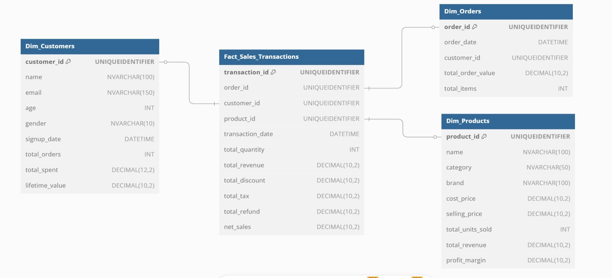
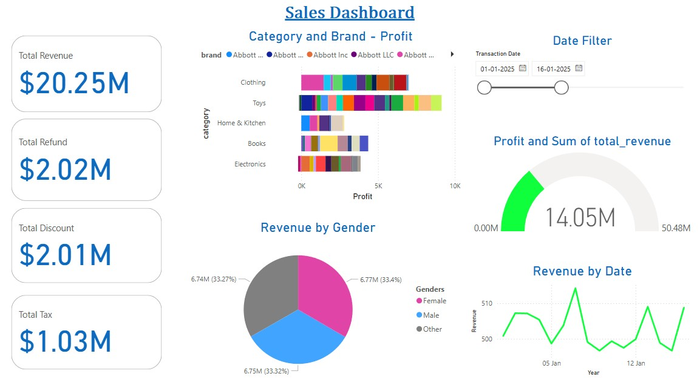

# E-Commerce Data Warehouse Project  

## Overview  
This project builds a **Data Warehouse** for an **E-Commerce & Retail platform**, leveraging **Bronze, Silver, and Gold layers** to structure data efficiently. The final **Gold layer** powers **Power BI dashboards** for business insights.  

## Data Warehouse Architecture  
The architecture follows a **multi-layered approach**:  

- **Bronze Layer (Raw Data)** → Ingests raw data from APIs, databases, and CSVs  
- **Silver Layer (Cleaned & Processed Data)** → Cleansed, transformed, and validated data  
- **Gold Layer (Aggregated & Business-Ready Data)** → Used for reporting & analytics  

## Star Schema  
The **Gold Layer** follows the **Star Schema**:  




## Setup & Installation  

### 1) Prerequisites**  
Ensure you have the following installed:  
- Python (>= 3.8)  
- SQL Server  
- Power BI
- PySpark (`pip install pyspark==3.5.3`)
- PyODBC (`pip install pyodbc`)  
- Faker (`pip install faker`)  

### 2) Clone the Repository 
```bash
git clone https://github.com/YajithVishwa/Sales.DataWareHouse.ETL.git
cd Sales.DataWareHouse.ETL
```

### 3) Run the SQL Scripts

Execute all 3 sql scripts - raw, silver and gold table creation

### 4) Execute PySpark Scripts

Execute in this order

- Raw Pyspark Script
- Silver Pyspark Script
- Gold Pyspark Script

### 5) Run the Power BI File

This will display the dashboard data


